# SE201 : Projet 1
##### Lucie Molinié, Isaïe Muron, Florian Tarazona

---

\newpage
---
## Partie 1 - Jeu d'instruction RISC-V

### Le programme

Pour traduire ce programme :
- On traduit d'abord les instructions hexadécimales en binaires
- On identifie le format des instructions et leur mnémonique à l'aide de la documentation *RISC-V* (p.130) et de la dernière page du sujet

On obtient le résultat suivant :

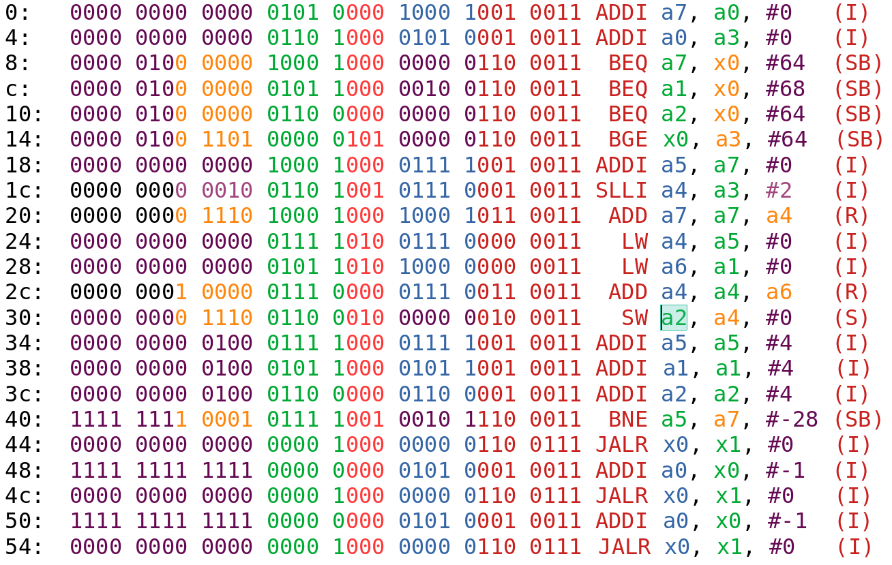\


On peut organiser le code en plusieurs parties et l'annoter pour mettre en avant les branchements :


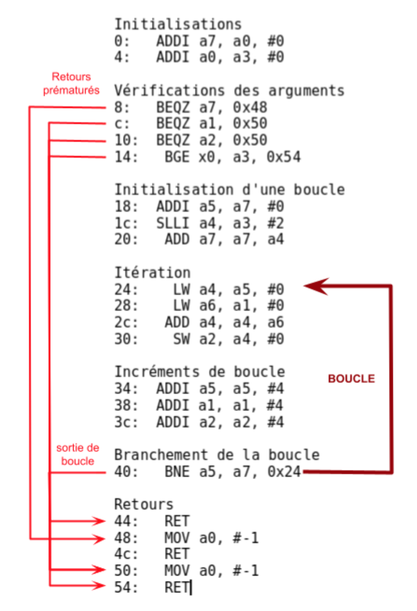{ width=80%, height=80%}\


Les incréments multiples de 4 pour `a1`, `a2` et `a5` suggèrent que ces registres contiennent des adresses. Cela est confirmé par leurs utilisations dans les instructions d’accès mémoire.


Le corps de la boucle charge deux valeurs, les additionne puis stocke le résultats dans une autre partie de la mémoire : **la fonction est un additionneur vectoriel**. Donnons finalement l’usage de la fonction :

`int add_vector(sc1_array, sc2_array, dst_array, size);`

- `sc1_array`, `sc2_array` sont les deux vecteurs à additionner.
- `dst_array` est le vecteur dans lequel on met le résultat.
- `size` est la taille des vecteurs

La fonction renvoie `-1` si l’un des vecteurs `dst`, `sc1`, `sc2` a une adresse nulle, `size` sinon.


### Les Branch Delay Slots

Dans tous les processeurs dont l’architecture est basée sur un pipeline, les instructions de branchement impliquent de casser le pipeline. \
En effet, prenons l’exemple d’un processeur RISC-V, basé sur un pipeline à 5 étages comme vu en cours, qui exécute l’instruction \

`bge a0, a1, #20`


Supposons que `a0 < a1`. Le processeur ne pourra s’en rendre compte qu’à l’étage d’EXÉCUTION du pipeline. À ce moment, l’instruction suivante dans la mémoire sera déjà dans l’étage de DÉCODAGE. Au coup d’horloge suivant, cette dernière, alors qu’elle vient d’être décodée, sera tuée par le processeur. Cela fait perdre au processeur un coup d’horloge.


Dans des architectures assez anciennes comme *MIPS*, la technique des branch delay slots était employée. Elle consiste simplement à exécuter l’instruction suivant une instruction de branchement. **C’était au programmeur de prêter attention à ce qu’il faisait.** Il pouvait toutefois profiter de cette instruction afin de prévoir par exemple une instruction pour aller chercher une donnée. Il pouvait concevoir des optimisation très fines, mais le code devenait moins lisible et les compilateurs plus difficiles à optimiser.


*RISC-V*, au contraire, prend le parti de ne pas nécessairement exécuter une instruction suivant un branchement. Cela permet au programmeur de gérer son code de manière plus naturelle. Toutefois, il est possible d’implémenter au sein du processeur un système de prédiction de branchement qui permettra de tenter de charger directement la bonne instruction.


\newpage
---
## Partie 2 - Outils de compilation RISC-V


Voici un programme d'addition vectorielle en C : 

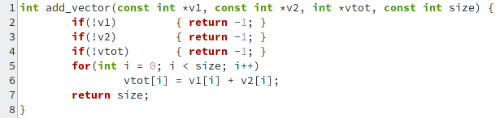{ width=70%}\

### Compilation avec `-O0`

Une première compilation avec `gcc` **sans optimisation** donne le code assembleur suivant :

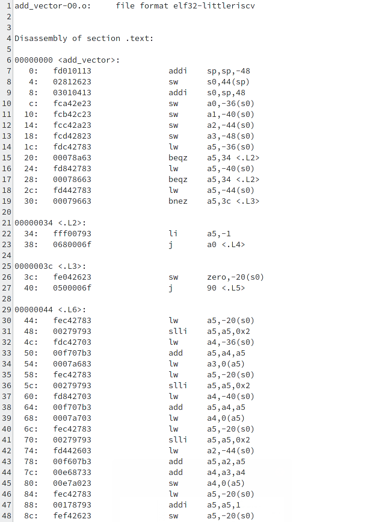{ width=70%, height=70%}\
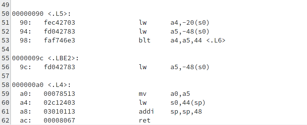{ width=70%, height=70%}\


Nous pouvons encore distinguer plusieurs parties :

- l’**initialisation de la stack**
- les vérifications et retours prématurés : **0x20, 0x28, 0x30, .L2, .L3**
- le retour de la fonction : **.L4**


Nous pouvons constater plusieurs points qui diffèrent de la première version présentée :

- L’utilisation d’instructions d’accès mémoire est systématique pour la lecture et l’écriture des variables. On peut par exemple reconnaître la suite d’instructions implémentant l’accès en lecture `v[i]`. *Pour l’accès en écriture, il suffit de remplacer le dernier LW par SW.*

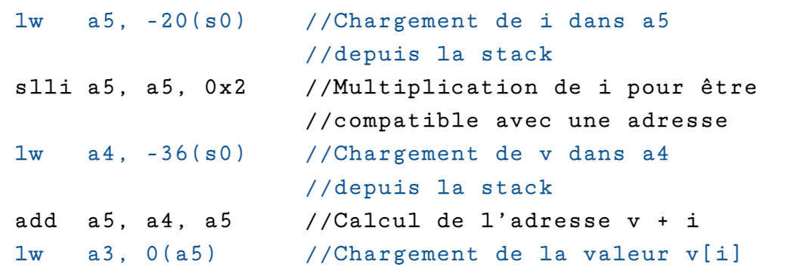\

- L’utilisation de la pile, alors que la première version se contentait de travailler avec les registres de travail a0 - a7.\
Une remarque surprenante est que la stack est initialisée avec une taille nettement supérieure aux besoins de la fonction : 12 mots-mémoire, mais seulement 6 utilisés. On peut représenter la stack ainsi :

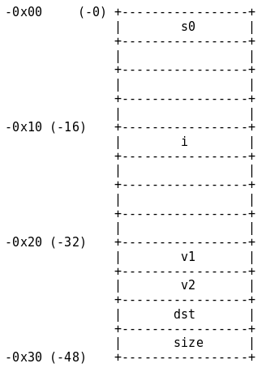{ width=40%, height=40%}\

Pour des raisons d’optimisation, gcc essaie d’aligner les éléments de la stack, comme l’indique [ce thread](https://github.com/riscv-collab/riscv-gcc/issues/61#issuecomment-291395688) sur GitHub. On peut modifier cela en utilisant l’argument `-mpreferred-stack-boundary=3`. On obtient alors :

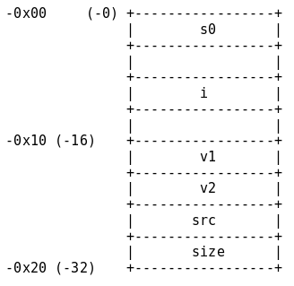{ width=30%, height=30%}\

- La gestion des branchements est également différente : on constate la présence d’un préambule **.L2** menant directement à **.L4** après avoir mis la valeur de retour à -1.


### Compilation avec `-O3`

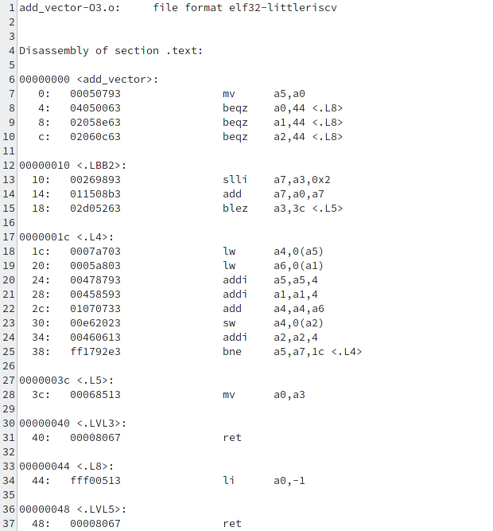{ width=50%, height=50%}\

On retrouve un code bien plus proche de la première version. On constate cependant quelques différences :

- Certaines instructions ne sont pas présentes, en particulier au début de la fonction ou à la fin. La structure est conservée néanmoins.
- Les *incréments d’adresses* sont effectués **de manière plus rapprochée** de *l’instruction d’accès mémoire* qui utilise l’adresse.\
On peut essayer d’expliquer cela comme une optimisation pour éviter de se retrouver confronté à une obligation de **stall** les instructions suivant directement les accès mémoire. En effet, dans le premier code, l’instruction `0x2C` devait être retardée car elle utilisait `a6` directement après sa lecture depuis la mémoire.\
On avait un potentiel problème également avec l’instruction `0x30` qui utilisait a4 directement après y avoir stocké un résultat de l’ALU. On peut éviter de retarder l’instruction en utilisant une technique de **data-forwarding**, en permettant à l’étage d’`EXÉCUTION` du processeurs de prendre en entrée la valeur calculée au coup d’horloge précédent.\
Ici, les adresses peuvent être incrémentées sans attendre, et ces instructions permettent d’attendre la ressource en faisant quelque chose d’utile.


\newpage
---
## Partie 3 - Architecture RISC-V

### Flot d'exécution

L’exécution pas à pas de la fonction avec les paramètres `(0x200, 0x200, 0x200, 0x2)` donne :


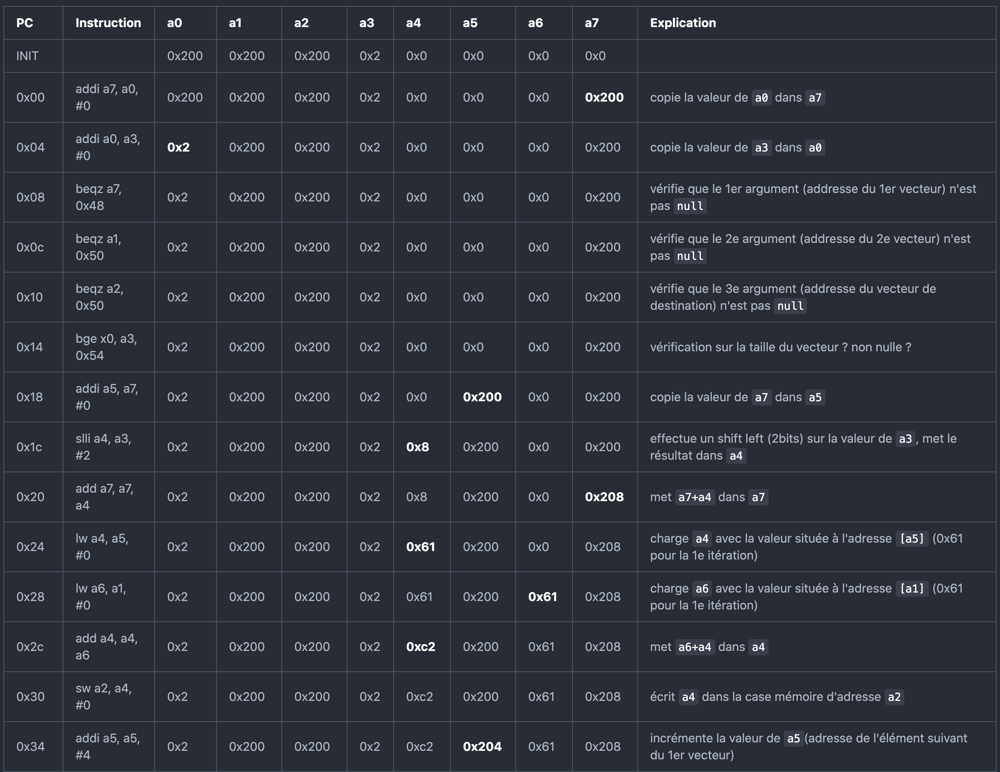\
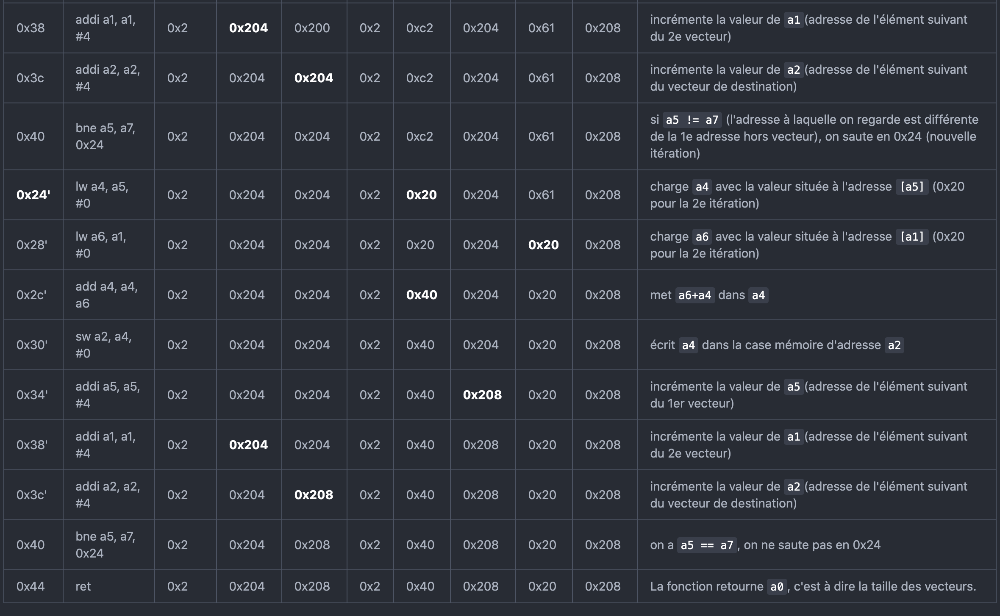\


### Pipelining

Afin d’illustrer les problématiques d’**aléas**, nous traçons partiellement les diagrammes de pipeline.


En temps normal (sans aléa), le diagramme est simplement le suivant :

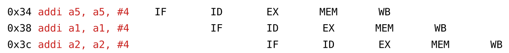\


Le _premier_ aléa ayant lieu dans l’exécution du programme se produit à la première vérification (instruction `0x08`) :

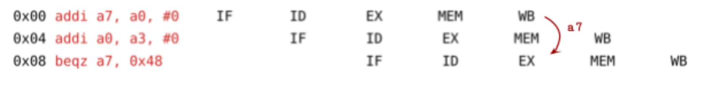\

L’instruction `beqz a7, 0x48` a besoin de la valeur de `a7`, mais celle-ci n’a pas encore été réécrite par l’instruction `0x00` qui en est encore à l’étape `WRITEBACK`. Cette étape peut simplement **forwarder** la valeur de `a7` à l’étape d’`EXÉCUTION`.


Un _deuxième_ aléa se présente à l’instruction `0x2c` :

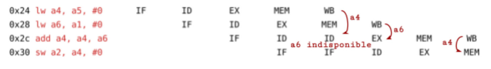\

À l’étape d’EXÉCUTION, l’instruction `0x2c` (`add a4, a4, a6`) requiert les valeurs de `a4` et `a6`. `a4` est mis à jour par l’instruction `0x24` (`lw a4, a5, #0`), qui a fini de lire la mémoire. L’étape `WRITEBACK` peut alors **forwarder** la valeur. Cependant, l’instruction `0x28` (`lw a6, a1, #0`) n’a pas fini de récupérer la valeur de `a6` dans la mémoire.\

Dans ce cas, aucun **forwarding** n’est envisageable : la pipeline est **stalled**, mise en attente jusqu’à ce que `WRITEBACK` puisse **forwarder** la valeur de `a6`.\

L’instruction `0x30` (`sw a2, a4, #0`) requiert durant la phase d’`ACCÈS MÉMOIRE` la valeur de `a4`, qui vient d’être modifiée par l’instruction `0x2c`. L’étape de `WRITEBACK` **forward** la valeur de `a4`.\

Imaginons le cas où l’instruction `0x2c` avait effectué un calcul sur `a2`. Dans ce cas, l’instruction `0x30` aurait eu besoin de cette nouvelle valeur durant l’étape d’`EXÉCUTION` qui se charge du calcul de l’adresse. L’étape d’`ACCÈS MÉMOIRE` aurait alors **forwardé** la valeur de `a2` à l’étape d’`EXÉCUTION`.\


Enfin, le cas d’un branchement pris est visible à l’instruction `0x40`. C'est le _troisième_ aléa :

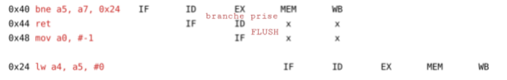\

À l’étape d’`EXÉCUTION` l’instruction `0x40` (`bne a5, a7, 0x24`) détermine qu’il faut effectuer un branchement sur l’instruction `0x24`. Les deux instructions suivantes, qui viennent d’être chargées de la mémoire, sont **flushées** et l’instruction `0x24` est **fetched** (l’adresse a été calculée lors de l’étape d’`EXÉCUTION` par l’instruction de branchement).


\newpage
---
## Partie 4 - Processor Design

### Instruction Set Architecture

#### Instruction Set
\

Dans un premier temps, nous imaginons un set d’instruction codées sur **16 bits**. La difficulté est alors de **compacter** les informations. L’instruction de **branchement conditionnelle** `beqz` devant avoir un immédiat de **10 bits** et un numéro de registre codé sur **4 bits**, il ne reste que **2 bits** afin de définir un **opcode** pour différencier l’instruction.


En considérant un **opcode de 2 bits**, on ne pourrait alors définir que **4 instructions**.\
Pour pallier à ce problème, on définit, pour d’autres types d’instructions, **1 à 2 bits** dits “de fonction” permettant de différencier plusieurs instructions appartenant à une même catégorie.


Cependant **deux instructions de même opcode n’ont pas toujours le même format**. Ci-dessous est décrit le jeu d’instructions que nous avons imaginé :

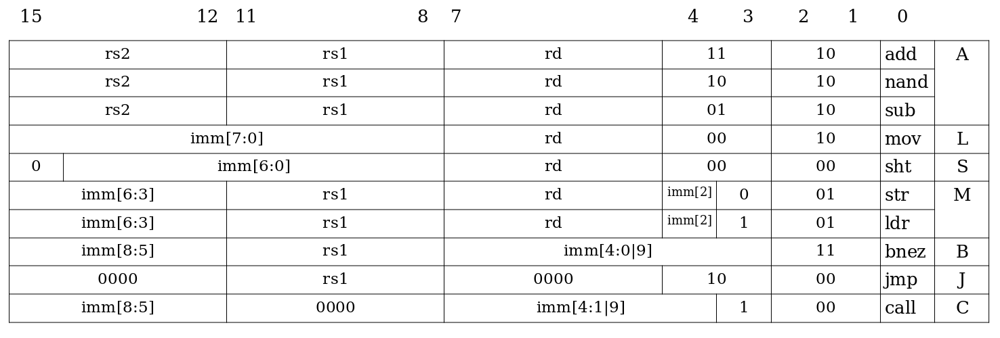\

Nous détaillons les instructions.


##### 1 - Instructions arithmétiques - format A
\

Le jeu d’instructions dispose de **3 instructions artihmétiques** :

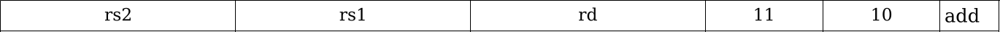\
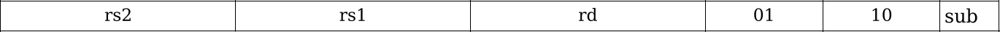\
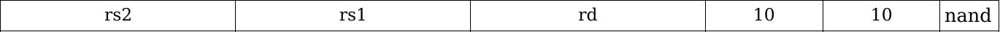\

`add rd, rs1, rs2` effectue la somme de `rs1` et `rs2`, puis la stocke dans `rd`. Les opérandes sont signées.
```
	rd ← rs1 + rs2
```


`sub rd, rs1, rs2` effectue la différence entre `rs1` et `rs2`, puis la stocke dans `rd`. Les opérandes sont signées.
```
	rd ← rs1 - rs2
```


`nand rd, rs1, rs2` effectue l’opération logique and bit à bit entre `rs1` et `rs2`, puis stocke la négation de ce résultat dans `rd`.
```
	rd ← ~(rs1 & rs2)
```
Le choix d’avoir implémenter `nand` permet de calculer toute opération logique par universalité de `nand`.


##### 2 - Instructions de chargement - format L
\

La compacité du jeu d’instructions ne nous permet pas d’avoir des opérations arithmétiques avec opérandes immédiates. Afin de pallier à cela, nous implémentons une instruction `mov` :

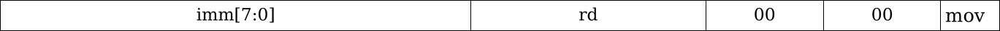\

`mov rd, imm` charge `imm` dans le registre `rd`. L’immédiat est un octet. Il est chargé dans l’octet de poids faible.


##### 3 - Instruction de décalage - format S
\

L’instruction de chargement d’immédiat ne permet de stocker qu’un octet. Afin de remplir un registre avec une valeur immédiate de 32 bits, nous implémentons une instruction de décalage :

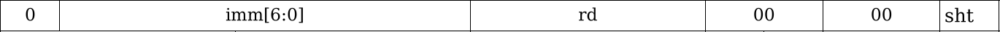\

`sht rd, imm` effectue un décalage logique de la valeur du registre `rd`. L’immédiat est signé, de sorte que le décalage puisse être fait vers la gauche ou la droite.


_Le stockage dans un registre d’un immédiat de 32 bit doit se faire octet par octet, en partant de l’octet de poids fort :_
```
mov r0, byte0; sht r0, #24
mov r0, byte1; sht r0, #16
mov r0, byte2; sht r0, #8
mov r0, byte3
```


##### 4 - Instructions d'interaction mémoire - format M
\

Afin d’accéder à la mémoire de données, le jeu d’instructions dispose d’instructions de load et store :

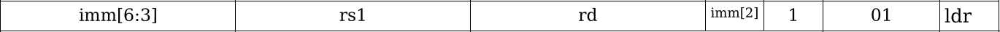\
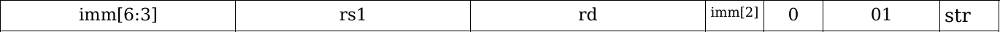\

`ldr rd, rs1, imm` charge la valeur située à l’adresse `rs1 + imm` dans le registre `rd`. La valeur de `rs1` est non signée, celle de l’immédiat est signée.
```
	rd ← data_memory[rs1 + imm
```


`str rd, rs1, imm` charge la valeur située à l’adresse `rs1 + imm` dans le registre `rd`. La valeur de `rs1` est non signée, celle de l’immédiat est signée.
```
	data_memory[rs1 + imm] ← rs1
```


_La valeur de l’immédiat respecte l’alignement sur 32 bits** des valeurs en mémoire. De la même manière, les deux bits de poids faible de `rs1` sont ignorés._


##### 5 - Instruction de branchement - format B
\

Nous fournissons une instruction de branchement conditionnel :

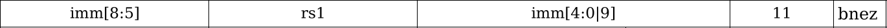\

`bnez rs1, imm` teste si la valeur du registre `rs1` est non nulle. Si elle l’est, elle effectue alors un saut à l’adresse `pc + imm*2`. La valeur de `rs1` et de l’immédiat sont signées.
```
	if rs1 != 0
		pc ← pc + imm * 2
```


_L’immédiat n’est pas aligné sur 16 bits (1 instruction). Il représente le nombre d’instructions dont on se décale par rapport à l’instruction en cours._


_Si la branche est prise, l’instruction suivant le branchement est exécutée. Si cette instruction est un saut (J), un branchement (B) ou un appel (C ), ses effets sont ignorés._


##### 6 - Instruction de saut inconditionnel - format J
\

Le jeu d’instruction permet également d’effectuer un saut inconditionnel :

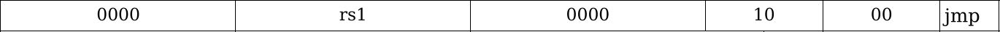\

`jmp rs1` charge la valeur de `rs1` dans pc.
```
	pc ← rs1
```


_Le bit de poids faible de `rs1` est ignoré afin de respecter l’alignement sur 16 bits._


_L’instruction suivant le saut est exécutée. Si cette instruction est un saut (J), un branchement (B) ou un appel (C ), ses effets sont ignorés._


##### 7 - Instruction d’appel de fonction (format C)
\

Nous fournissons une instruction simplifiant l’appel de fonctions :

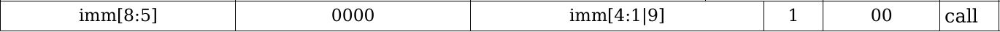\

`call imm` enregistre la valeur de `pc` dans `lr` puis charge la valeur de l’immédiat dans `pc`. L’immédiat est signé.
```
	lr ← pc
	pc ← imm
```


_La valeur de l’immédiat est alignée sur 16 bits._


##### 8 - Instruction nop
\

Le jeu d’instructions ne propose pas d’instruction `nop` spécifique. Néanmoins nous pouvons utiliser l’instruction de décalage afin de trouver une instruction qui n’effectue aucun changement sur les registres. 


Il s’agit de l’instruction nulle `0x0000` qui n’est autre que `sht r0, #0`.
Cette instruction décale la valeur de `r0` de 0 bits, i.e. n’effectue aucun changement.

#### Registers
\

Le processeur dispose de 16 registres, dont certains ont des fonctions particulières :

|Registre(s)| Utilisation               |
|-----------|---------------------------|
| r0        | return value              |
| r0 - r3   | function arguments        |
| r0 - r12  | general purpose registers |
| r13 (sp)  | stack pointer             |
| r14 (lr)  | link register             |
| r15 (pc)  | program counter           |


Un programmeur **ne devrait pas écrire directement dans `lr` ou `pc`**. Il devrait pour cela utiliser les instructions de branchement.


Lors d’un **appel de fonction**, la fonction appelante donne ses arguments à la fonction appelée dans les registres `r0 - r3`. La fonction appelée est à même de modifier tout registre de travail (`r0 - r12`). Elle doit donc sauvegarder les registres qu’elle utilise dans la stack grâce à `sp`, en particulier le `link register`.


La **fonction appelante** exécute enfin l’instruction `call`. Cette instruction effectue un saut inconditionnel vers l’adresse contenue dans le registre d’opérande. Elle sauvegarde également l’instruction suivante de la fonction appelante dans le `link register`.

La **fonction appelée** s’exécute et se termine par la libération de la stack qu’elle a prise puis une instruction `jmp` sur le `link register`. La fonction appelante restore ses registres depuis la stack.

Donnons un exemple :\

```
callee:

	mov r12, #4
	sub sp, sp, r12
	add r0, r0, r1
	add r0, r0, r2
	add sp, sp, r12
	jmp lr

caller:
	//On souhaite sauvegarder r4, r5, r6
	mov r0, #0
	mov r1, #4
	mov r2, #5
	mov r12, #12
	sub sp, sp, r12
	str r4, sp
	str r5, sp, #4
	str r6, sp, #8
	call callee
	ldr r4, sp
	ldr r5, sp, #4
	ldr r6, sp, #8
	add sp, sp, r12
```


#### Application
\

Nous pouvons à l’aide de nos nouvelles instructions réécrire la fonction d’addition vectorielle. Nous rappelons la définition de ses arguments :
- `r0` : Adresse du premier vecteur
- `r1` : Adresse du deuxième vecteur
- `r2` : Adresse du vecteur somme
- `r3` : Taille du vecteur

Pour commencer nous pouvons définir un registre à 0 en une seule instruction de décalage : le décalage étant logique, il suffit de décaler un registre de 32 bits. Nous utiliserons `r4`, premier registre de travail non réservé aux arguments :\

```
	0x00		sht r4, #32
```

Il faut ensuite effectuer des vérifications sur la non-nullité des adresses des vecteurs. Nous utilisons l’instruction bnez. Si le branchement est effectué, cela signifie que l’adresse est non nulle, donc valide. Cela signifie que nous aurons trois branchements dans une exécution normale de la fonction. Les performances en seront réduites mais nous verront par la suite comment faire usage du branch delay slot afin de limiter cela.\

```
	0x02		bnez r0, 0x08
	0x04		bnez r1, 0x0c
	0x06		bnez r2, 0x10
```

Il nous faut ensuite vérifier la validité de la taille du vecteur. Un branchement doit être effectué vers le retour de la fonction si la taille est positive ou nulle. Pour cela on regarde d’abord si la taille est négative en regardant son bit de poids fort. Puis on teste si elle vaut 0 en lui retranchant 1 et en vérifiant si ce résultat est négatif de la même manière. Il faut tout d’abord avoir transféré la taille demandée dans `r0`, en cas de retour prématuré.\

```
	//Transfert de la taille dans r0, on sauvegarde dans r5
	0x08		add r5, r4, r0
	0x0a		add r0, r4, r3

	//On crée un masque pour sélectionner le bit de poids fort
	0x0c		mov r6, #80
	0x0e		sht r6, #24

	//On sélectionne le bit de poids fort de r3 avec un and
	//(deux nand successifs)
	0x10		nand r7, r3, r6
	0x12		nand r7, r7, r7

	//On teste si r3 était négatif
	0x14		bnez r7, ... (retour)

	//On crée une variable temporaire à -1 dans r8
	//(r8 ← 0xffffffff)
	0x16		sht r8, #32
	0x18		nand r8, r8, r8

	//On teste la nullité de r3
	0x1a		add r7, r3, r8
	0x1c		nand r7, r7, r6
	0x1e		nand r7, r7, r7
	0x20		bnez r7, ... (retour)
```

On peut désormais entamer la boucle. Pour gérer les indices nous allons utiliser `r3`, décrémenter sa valeur à chaque itération jusqu’à son annulation.\

```
	//On crée une variable à 4 
	0x22		sht r9, #32
	0x24		mov r9, #4

	//Corps de la boucle
	0x26		ldr r10, r5
	0x28		add r5, r5, r9
	0x2a		ldr r11, r1
	0x2c		add r1, r1, r9
	0x2e		add r3, r3, r8
	0x30		add r10, r10, r11
	0x32		str r10, r2
	0x34		add r2, r2, r9
	0x36		bnez r3, ... (début de boucle, 0x4c)
```

On termine enfin par les instructions de retours : un retour normal ainsi qu’un retour à -1.\

```
	0x38		jmp lr
	0x3a		sht r0, #32
	0x3c		nand r0, r0, r0
	0x3e		jmp lr
```

Nous allons maintenant apporter quelques modifications et présenter un code plus lisible. Tout d’abord, nous avons pu remarqué que deux valeurs constantes sont utilisées dans la fonction : 0, -1 et 4. Nous allons les définir dès le début de la fonction dans les registres `r4`, `r5`, `r6`.\
Ensuite, nous utilisons les branch delay slots en plaçant une instruction à la suite de chaque instruction de branchement. Cette instruction sera toujours exécutée.

```
define_constants:
	0x00		sht r4, #32		//r4 ← 0
	0x02		sht r5, #32
	0x04		nand r5, r5, r5	//r5 ← -1
	0x06		sht r6, #32
	0x08		mov r6, #4		//r6 ← 4

check_addresses:
	//On intercale le transfert de r3
	0x0a		bnez r0, #24 <invalid_ret>
	0x0c		add r7, r4, r0
	0x0e		bnez r1, #22 <invalid_ret>
	0x10		add r0, r4, r3
	0x12		bnez r2, #20 <invalid_ret>
	0x14		mov r8, 0x80		//On commence à créer un
									//masque 0x8000000
	
check_size:
	0x16		sht r8, #24
	0x18		nand r9, r3, r8
	0x1a		nand r9, r9, r9
	0x1c		bnez r9, #14 <ret>
	0x1e		add r9, r3, r5
	0x20		nand r9, r9, r8
	0x22		nand r9, r9, r9
	0x24		bnez r9, #10 <ret>
	
loop:
	//Nous n’avons plus besoin de r8 et r9, nous nous en
	//servons pour récupérer les valeurs de la mémoire
	0x26		ldr r8, r7, #0
	0x28		add r7, r7, r6
	0x2a		ldr r9, r1, #0
	0x2c		add r1, r1, r6
	0x2e		add r8, r8, r9
	0x30		str r8, r2, #0
	0x32		add r3, r3, r5
	0x34		bnez r3, #-7 <loop>
	0x36		add r2, r2, r6

ret:
	0x38		jmp lr
	
invalid_ret:
	0x3a		add r0, r4, r5
	0x3c		jmp lr
```

### Pipelining

#### Processor diagram
\

En utilisant pour référence le processeur abordé en classe et en l'adaptant à notre jeu d'instructions, on obtient le diagramme suivant :

\

Comme indiqué dans l'énoncé, le processeur fait usage d'un pipeline à 3 étages :
- Le premier étage, `Instruction Fetch`, est inchangé par rapport au cours
- Le deuxième étage, `Instruction Decode`, inclut désormais l'exécution des instructions modifiant le PC (`bnez`, `jmp`, `call`). Pour effectuer ce changement, le bloc de calcul a été ramené avant la bascule D associée (`ID/EX`). Cela est possible car notre seule instruction de saut conditionnel teste si un registre donné est non-nul. Il n'y a donc pas besoin d'attendre un calcul de l'ALU pour obtenir notre condition, on peut directement faire la vérification à la sortie du bloc `REGISTER FILES`.
- Le troisième étage, `Execute`, comprend désormais toutes les étapes des accès mémoire (calcul d'adresse, lecture, écriture). Il n'y a pas de bascule D sur les signaux RgWE, RgWId, RgWSel : l'écriture des registres se fait au début de `EX`, tandis que sa lecture à la fin de l'étape `ID`.


Les signaux décodés sont mis à jour selon l'instruction reçue. Un signal restant inchangé d'une instruction précédente implique qu'il n'est pas utilisé ou qu'il sera ignoré par l'instruction courante. Voici un tableau explicatif des signaux :

| Nom du signal | Description |
|---------------|-------------|
| branch | Indique si l'instruction est un saut (1 pour `bnez`,`jmp`, 0 sinon) |


