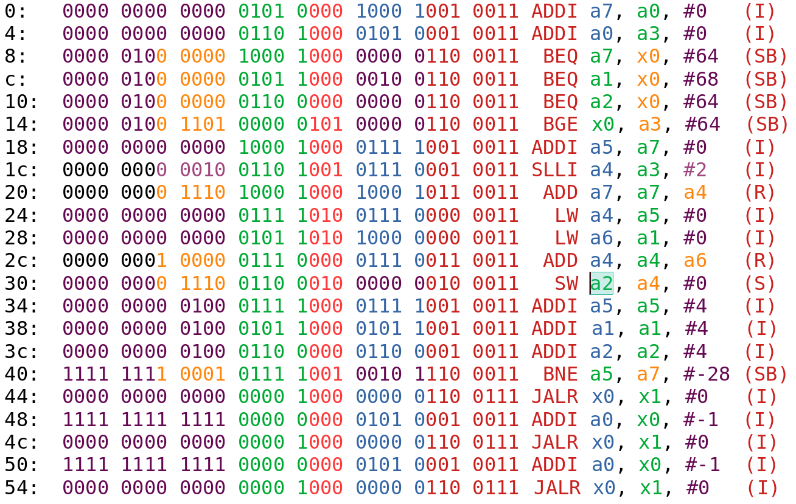
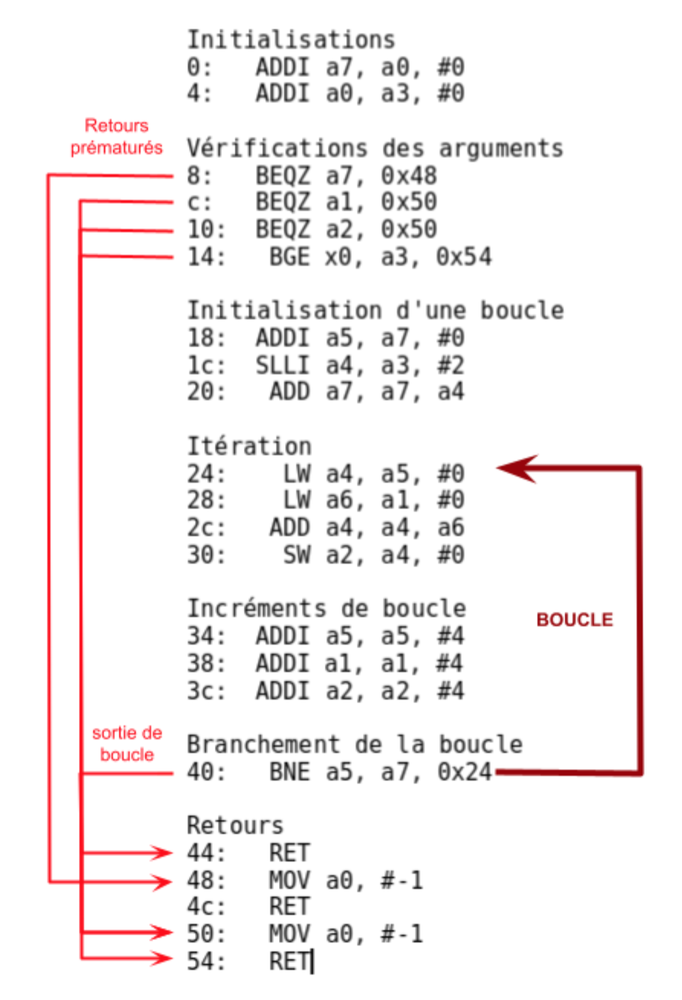

# SE201 : Projet 1
##### Lucie Molinié, Isaïe Muron, Florian Tarazona

---

\newpage


## Partie 1 - Jeu d'instruction RISC-V

### Le programme

Pour traduire ce programme :
- On traduit d'abord les instructions hexadécimales en binaires
- On identifie le format des instructions et leur mnémonique à l'aide de la documentation *RISC-V* (p.130) et de la dernière page du sujet

On obtient le résultat suivant :

\


On peut organiser le code en plusieurs parties et l'annoter pour mettre en avant les branchements :


{ width=80%, height=80%}\


Les incréments multiples de 4 pour `a1`, `a2` et `a5`suggèrent que ces registres contiennent des adresses. Cela est confirmé par leurs utilisations dans les instructions d’accès mémoire.


Le corps de la boucle charge deux valeurs, les additionne puis stocke le résultats dans une autre partie de la mémoire : **la fonction est un additionneur vectoriel**. Donnons finalement l’usage de la fonction :

```
int add_vector(sc1_array(a0), // premier vecteur de à additionner
				sc2_array(a1), // second vecteur de à additionner
				dst_array(a2), // vecteur résultat
				size(a3) // taille des vecteurs
				);
				```
La fonction renvoie `-1` si l’un des vecteurs `dst`, `sc1`, `sc2` a une adresse nulle, `size` sinon.


### Les Branch Delay Slots

Dans tous les processeurs dont l’architecture est basée sur un pipeline, les instructions de branchement impliquent de casser le pipeline. \
En effet, prenons l’exemple d’un processeur RISC-V, basé sur un pipeline à 5 étages comme vu en cours, qui exécute l’instruction \

`bge a0, a1, #20`


Supposons que `a0 < a1`. Le processeur ne pourra s’en rendre compte qu’à l’étage d’EXÉCUTION du pipeline. À ce moment, l’instruction suivante dans la mémoire sera déjà dans l’étage de DÉCODAGE. Au coup d’horloge suivant, cette dernière, alors qu’elle vient d’être décodée, sera tuée par le processeur. Cela fait perdre au processeur un coup d’horloge.


Dans des architectures assez anciennes comme *MIPS*, la technique des branch delay slots était employée. Elle consiste simplement à exécuter l’instruction suivant une instruction de branchement. **C’était au programmeur de prêter attention à ce qu’il faisait.** Il pouvait toutefois profiter de cette instruction afin de prévoir par exemple une instruction pour aller chercher une donnée. Il pouvait concevoir des optimisation très fines, mais le code devenait moins lisible et les compilateurs plus difficiles à optimiser.


*RISC-V*, au contraire, prend le parti de ne pas nécessairement exécuter une instruction suivant un branchement. Cela permet au programmeur de gérer son code de manière plus naturelle. Toutefois, il est possible d’implémenter au sein du processeur un système de prédiction de branchement qui permettra de tenter de charger directement la bonne instruction.
