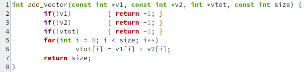
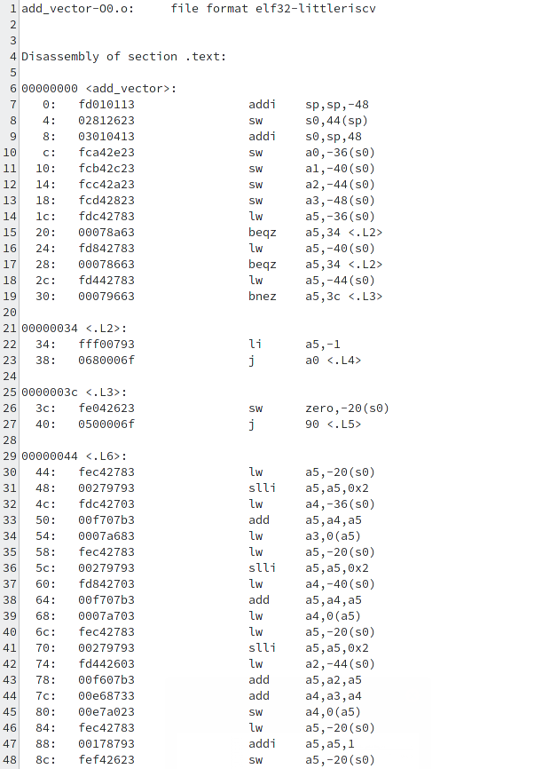
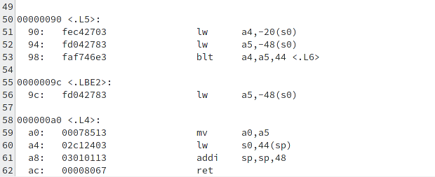
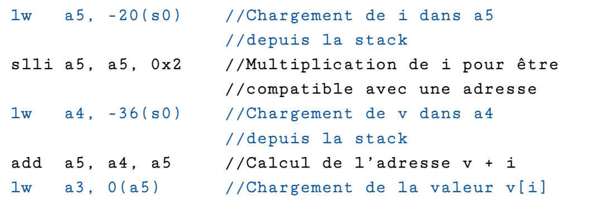
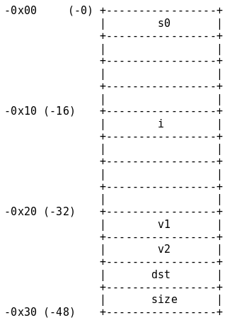
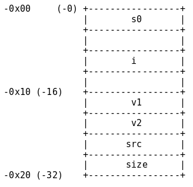
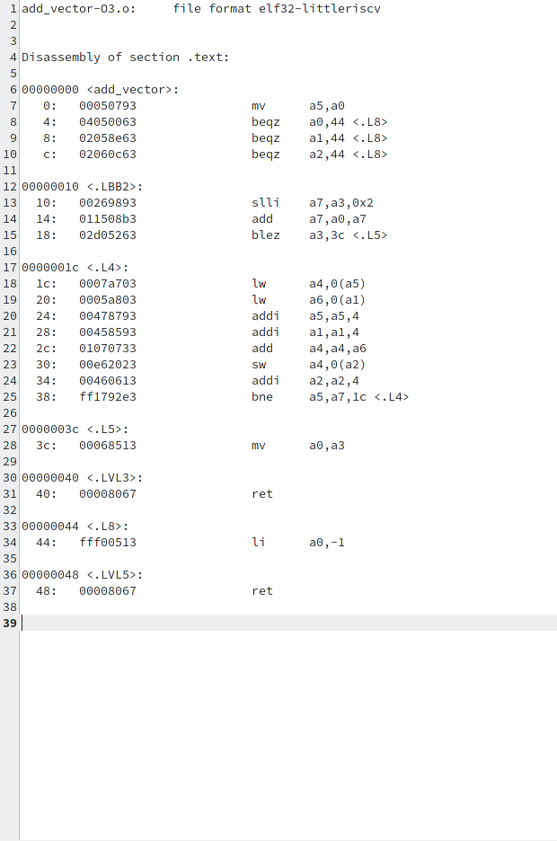
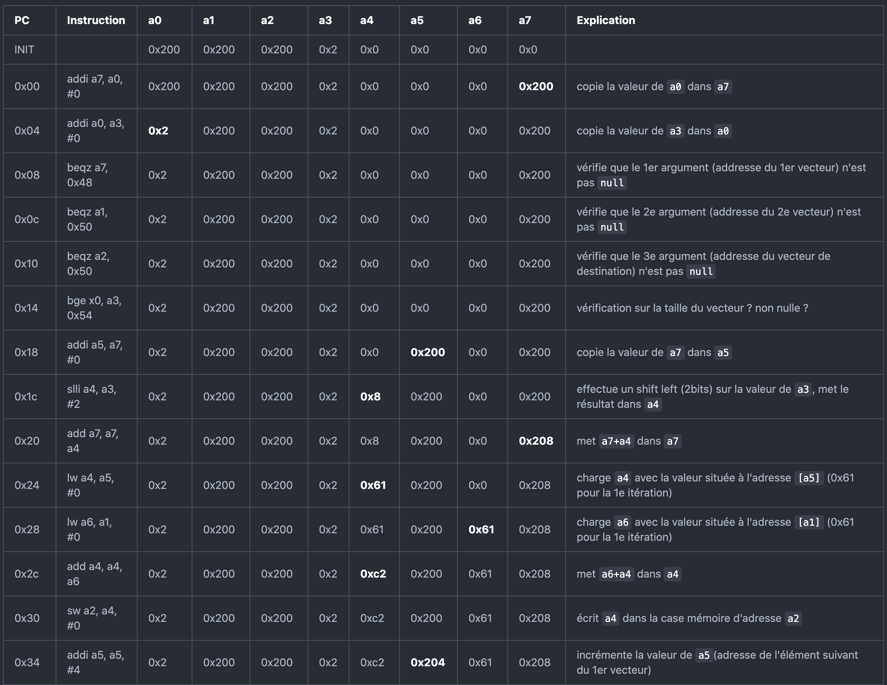
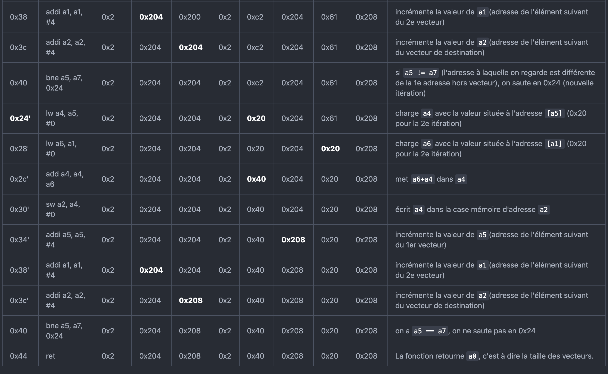

# SE201 : Projet 1
##### Lucie Molinié, Isaïe Muron, Florian Tarazona

---

\newpage
---
## Partie 1 - Jeu d'instruction RISC-V

### Le programme

Pour traduire ce programme :
- On traduit d'abord les instructions hexadécimales en binaires
- On identifie le format des instructions et leur mnémonique à l'aide de la documentation *RISC-V* (p.130) et de la dernière page du sujet

On obtient le résultat suivant :

\

On peut organiser le code en plusieurs parties et l'annoter pour mettre en avant les branchements :

{ width=80%, height=80%}\

Les incréments multiples de 4 pour `a1`, `a2` et `a5` suggèrent que ces registres contiennent des adresses. Cela est confirmé par leurs utilisations dans les instructions d’accès mémoire.

Le corps de la boucle charge deux valeurs, les additionne puis stocke le résultats dans une autre partie de la mémoire : **la fonction est un additionneur vectoriel**. Donnons finalement l’usage de la fonction :

`int add_vector(sc1_array, sc2_array, dst_array, size);`

- `sc1_array`, `sc2_array` sont les deux vecteurs à additionner.
- `dst_array` est le vecteur dans lequel on met le résultat.
- `size` est la taille des vecteurs

La fonction renvoie `-1` si l’un des vecteurs `dst`, `sc1`, `sc2` a une adresse nulle, `size` sinon.

### Les Branch Delay Slots

Dans tous les processeurs dont l’architecture est basée sur un pipeline, les instructions de branchement impliquent de casser le pipeline. \
En effet, prenons l’exemple d’un processeur RISC-V, basé sur un pipeline à 5 étages comme vu en cours, qui exécute l’instruction \

`bge a0, a1, #20`

Supposons que `a0 < a1`. Le processeur ne pourra s’en rendre compte qu’à l’étage d’EXÉCUTION du pipeline. À ce moment, l’instruction suivante dans la mémoire sera déjà dans l’étage de DÉCODAGE. Au coup d’horloge suivant, cette dernière, alors qu’elle vient d’être décodée, sera tuée par le processeur. Cela fait perdre au processeur un coup d’horloge.

Dans des architectures assez anciennes comme *MIPS*, la technique des branch delay slots était employée. Elle consiste simplement à exécuter l’instruction suivant une instruction de branchement. **C’était au programmeur de prêter attention à ce qu’il faisait.** Il pouvait toutefois profiter de cette instruction afin de prévoir par exemple une instruction pour aller chercher une donnée. Il pouvait concevoir des optimisation très fines, mais le code devenait moins lisible et les compilateurs plus difficiles à optimiser.

*RISC-V*, au contraire, prend le parti de ne pas nécessairement exécuter une instruction suivant un branchement. Cela permet au programmeur de gérer son code de manière plus naturelle. Toutefois, il est possible d’implémenter au sein du processeur un système de prédiction de branchement qui permettra de tenter de charger directement la bonne instruction.

\newpage
---
## Partie 2 - Outils de compilation RISC-V

Voici un programme d'addition vectorielle en C : 

{ width=70%}\

### Compilation avec `-O0`

Une première compilation avec `gcc` **sans optimisation** donne le code assembleur suivant :

{ width=70%, height=70%}\
{ width=70%, height=70%}\

Nous pouvons encore distinguer plusieurs parties :

- l’**initialisation de la stack**
- les vérifications et retours prématurés : **0x20, 0x28, 0x30, .L2, .L3**
- le retour de la fonction : **.L4**

Nous pouvons constater plusieurs points qui diffèrent de la première version présentée :

- L’utilisation d’instructions d’accès mémoire est systématique pour la lecture et l’écriture des variables. On peut par exemple reconnaître la suite d’instructions implémentant l’accès en lecture `v[i]`. *Pour l’accès en écriture, il suffit de remplacer le dernier LW par SW.*

\

- L’utilisation de la pile, alors que la première version se contentait de travailler avec les registres de travail a0 - a7.\
Une remarque surprenante est que la stack est initialisée avec une taille nettement supérieure aux besoins de la fonction : 12 mots-mémoire, mais seulement 6 utilisés. On peut représenter la stack ainsi :

{ width=40%, height=40%}\

Pour des raisons d’optimisation, gcc essaie d’aligner les éléments de la stack, comme l’indique [ce thread](https://github.com/riscv-collab/riscv-gcc/issues/61#issuecomment-291395688) sur GitHub. On peut modifier cela en utilisant l’argument `-mpreferred-stack-boundary=3`. On obtient alors :

{ width=30%, height=30%}\

- La gestion des branchements est également différente : on constate la présence d’un préambule **.L2** menant directement à **.L4** après avoir mis la valeur de retour à -1.

### Compilation avec `-O3`

{ width=50%, height=50%}\

On retrouve un code bien plus proche de la première version. On constate cependant quelques différences :

- Certaines instructions ne sont pas présentes, en particulier au début de la fonction ou à la fin. La structure est conservée néanmoins.
- Les *incréments d’adresses* sont effectués **de manière plus rapprochée** de *l’instruction d’accès mémoire* qui utilise l’adresse.\
On peut essayer d’expliquer cela comme une optimisation pour éviter de se retrouver confronté à une obligation de **stall** les instructions suivant directement les accès mémoire. En effet, dans le premier code, l’instruction `0x2C` devait être retardée car elle utilisait `a6` directement après sa lecture depuis la mémoire.\
On avait un potentiel problème également avec l’instruction `0x30` qui utilisait a4 directement après y avoir stocké un résultat de l’ALU. On peut éviter de retarder l’instruction en utilisant une technique de **data-forwarding**, en permettant à l’étage d’`EXÉCUTION` du processeurs de prendre en entrée la valeur calculée au coup d’horloge précédent.\
Ici, les adresses peuvent être incrémentées sans attendre, et ces instructions permettent d’attendre la ressource en faisant quelque chose d’utile.

\newpage
---
## Partie 3 - Architecture RISC-V

### Flot d'exécution

L’exécution pas à pas de la fonction avec les paramètres `(0x200, 0x200, 0x200, 0x2)` donne :

\
\

### Pipelining

Afin d’illustrer les problématiques d’**aléas**, nous traçons partiellement les diagrammes de pipeline.

En temps normal (sans aléa), le diagramme est simplement le suivant :

\

Le premier aléa ayant lieu dans l’exécution du programme se produit à la première vérification (instruction `0x08`) :

\

L’instruction `beqz a7, 0x48` a besoin de la valeur de `a7`, mais celle-ci n’a pas encore été réécrite par l’instruction `0x00` qui en est encore à l’étape `WRITEBACK`. Cette étape peut simplement **forwarder** la valeur de `a7` à l’étape d’`EXÉCUTION`.

Un deuxième aléa se présente à l’instruction `0x2c` :

\

À l’étape d’EXÉCUTION, l’instruction `0x2c` (`add a4, a4, a6`) requiert les valeurs de `a4` et `a6`. `a4` est mis à jour par l’instruction `0x24` (`lw a4, a5, #0`), qui a fini de lire la mémoire. L’étape `WRITEBACK` peut alors **forwarder** la valeur. Cependant, l’instruction `0x28` (`lw a6, a1, #0`) n’a pas fini de récupérer la valeur de `a6` dans la mémoire.\

Dans ce cas, aucun **forwarding** n’est envisageable : la pipeline est **stalled**, mise en attente jusqu’à ce que `WRITEBACK` puisse **forwarder** la valeur de `a6`.\

L’instruction `0x30` (`sw a2, a4, #0`) requiert durant la phase d’`ACCÈS MÉMOIRE` la valeur de `a4`, qui vient d’être modifiée par l’instruction `0x2c`. L’étape de `WRITEBACK` **forward** la valeur de `a4`.\

Imaginons le cas où l’instruction `0x2c` avait effectué un calcul sur `a2`. Dans ce cas, l’instruction `0x30` aurait eu besoin de cette nouvelle valeur durant l’étape d’`EXÉCUTION` qui se charge du calcul de l’adresse. L’étape d’`ACCÈS MÉMOIRE` aurait alors **forwardé** la valeur de `a2` à l’étape d’`EXÉCUTION`.\

Enfin, le cas d’un branchement pris est visible à l’instruction `0x40` :

\

À l’étape d’`EXÉCUTION` l’instruction `0x40` (`bne a5, a7, 0x24`) détermine qu’il faut effectuer un branchement sur l’instruction `0x24`. Les deux instructions suivantes, qui viennent d’être chargées de la mémoire, sont **flushées** et l’instruction `0x24` est **fetched** (l’adresse a été calculée lors de l’étape d’`EXÉCUTION` par l’instruction de branchement).

\newpage
---
## Partie 4 - Processor Design

### Bruh

### Bruh2

