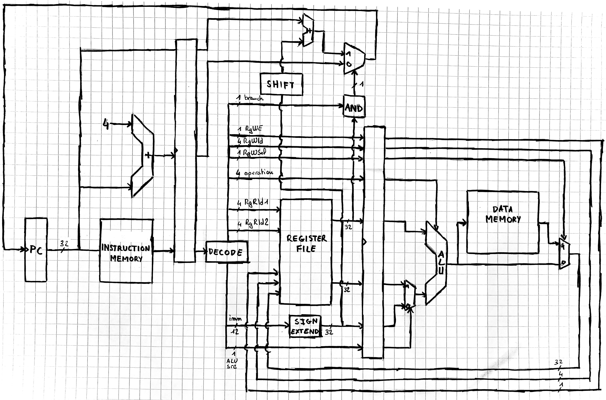
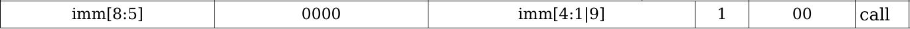
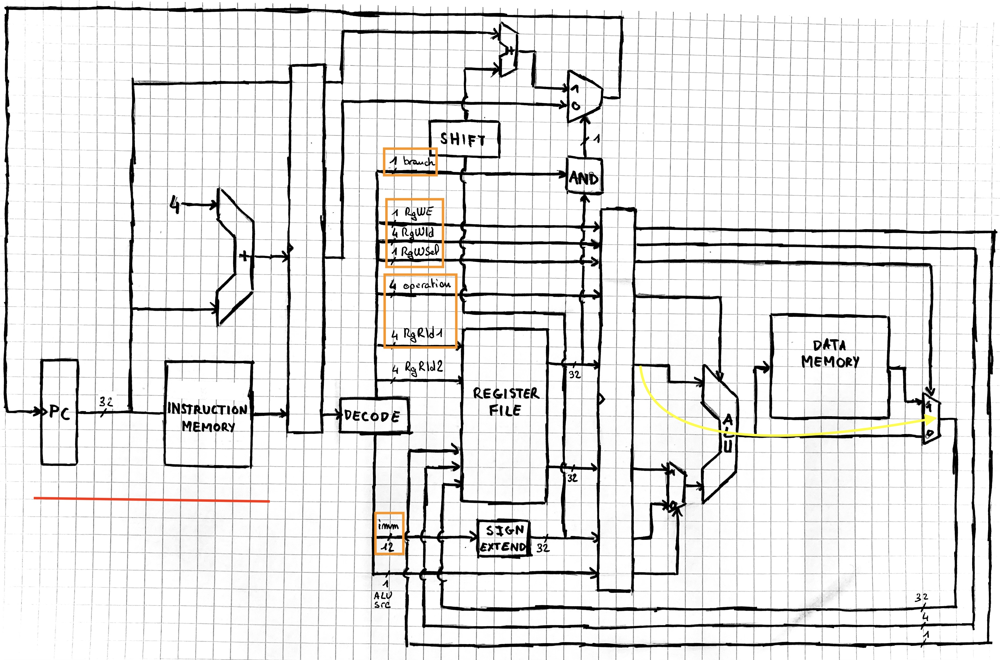

## Partie 2 - Outils de compilation RISC-V


Voici un programme d'addition vectorielle en C : 

{ width=70%}\

### Compilation avec `-O0`

Une première compilation avec `gcc` **sans optimisation** donne le code assembleur suivant :

{ width=70%, height=70%}\
{ width=70%, height=70%}\


Nous pouvons encore distinguer plusieurs parties :

- l’**initialisation de la stack**
- les vérifications et retours prématurés : **0x20, 0x28, 0x30, .L2, .L3**
- le retour de la fonction : **.L4**


Nous pouvons constater plusieurs points qui diffèrent de la première version présentée :

- L’utilisation d’instructions d’accès mémoire est systématique pour la lecture et l’écriture des variables. On peut par exemple reconnaître la suite d’instructions implémentant l’accès en lecture `v[i]`. *Pour l’accès en écriture, il suffit de remplacer le dernier LW par SW.*

\

- L’utilisation de la pile, alors que la première version se contentait de travailler avec les registres de travail a0 - a7.\
Une remarque surprenante est que la stack est initialisée avec une taille nettement supérieure aux besoins de la fonction : 12 mots-mémoire, mais seulement 6 utilisés. On peut représenter la stack ainsi :

{ width=40%, height=40%}\

Pour des raisons d’optimisation, gcc essaie d’aligner les éléments de la stack, comme l’indique [ce thread](https://github.com/riscv-collab/riscv-gcc/issues/61#issuecomment-291395688) sur GitHub. On peut modifier cela en utilisant l’argument `-mpreferred-stack-boundary=3`. On obtient alors :

{ width=30%, height=30%}\

- La gestion des branchements est également différente : on constate la présence d’un préambule **.L2** menant directement à **.L4** après avoir mis la valeur de retour à -1.


### Compilation avec `-O3`

{ width=50%, height=50%}\

On retrouve un code bien plus proche de la première version. On constate cependant quelques différences :

- Certaines instructions ne sont pas présentes, en particulier au début de la fonction ou à la fin. La structure est conservée néanmoins.
- Les *incréments d’adresses* sont effectués **de manière plus rapprochée** de *l’instruction d’accès mémoire* qui utilise l’adresse.\
On peut essayer d’expliquer cela comme une optimisation pour éviter de se retrouver confronté à une obligation de **stall** les instructions suivant directement les accès mémoire. En effet, dans le premier code, l’instruction `0x2C` devait être retardée car elle utilisait `a6` directement après sa lecture depuis la mémoire.\
On avait un potentiel problème également avec l’instruction `0x30` qui utilisait a4 directement après y avoir stocké un résultat de l’ALU. On peut éviter de retarder l’instruction en utilisant une technique de **data-forwarding**, en permettant à l’étage d’`EXÉCUTION` du processeurs de prendre en entrée la valeur calculée au coup d’horloge précédent.\
Ici, les adresses peuvent être incrémentées sans attendre, et ces instructions permettent d’attendre la ressource en faisant quelque chose d’utile.


\newpage
---
## Partie 3 - Architecture RISC-V

### Flot d'exécution

L’exécution pas à pas de la fonction avec les paramètres `(0x200, 0x200, 0x200, 0x2)` donne :


\
\


### Pipelining

Afin d’illustrer les problématiques d’**aléas**, nous traçons partiellement les diagrammes de pipeline.


En temps normal (sans aléa), le diagramme est simplement le suivant :

\


Le _premier_ aléa ayant lieu dans l’exécution du programme se produit à la première vérification (instruction `0x08`) :

\

L’instruction `beqz a7, 0x48` a besoin de la valeur de `a7`, mais celle-ci n’a pas encore été réécrite par l’instruction `0x00` qui en est encore à l’étape `WRITEBACK`. Cette étape peut simplement **forwarder** la valeur de `a7` à l’étape d’`EXÉCUTION`.


Un _deuxième_ aléa se présente à l’instruction `0x2c` :

\

À l’étape d’EXÉCUTION, l’instruction `0x2c` (`add a4, a4, a6`) requiert les valeurs de `a4` et `a6`. `a4` est mis à jour par l’instruction `0x24` (`lw a4, a5, #0`), qui a fini de lire la mémoire. L’étape `WRITEBACK` peut alors **forwarder** la valeur. Cependant, l’instruction `0x28` (`lw a6, a1, #0`) n’a pas fini de récupérer la valeur de `a6` dans la mémoire.\

Dans ce cas, aucun **forwarding** n’est envisageable : la pipeline est **stalled**, mise en attente jusqu’à ce que `WRITEBACK` puisse **forwarder** la valeur de `a6`.\

L’instruction `0x30` (`sw a2, a4, #0`) requiert durant la phase d’`ACCÈS MÉMOIRE` la valeur de `a4`, qui vient d’être modifiée par l’instruction `0x2c`. L’étape de `WRITEBACK` **forward** la valeur de `a4`.\

Imaginons le cas où l’instruction `0x2c` avait effectué un calcul sur `a2`. Dans ce cas, l’instruction `0x30` aurait eu besoin de cette nouvelle valeur durant l’étape d’`EXÉCUTION` qui se charge du calcul de l’adresse. L’étape d’`ACCÈS MÉMOIRE` aurait alors **forwardé** la valeur de `a2` à l’étape d’`EXÉCUTION`.\


Enfin, le cas d’un branchement pris est visible à l’instruction `0x40`. C'est le _troisième_ aléa :

\

À l’étape d’`EXÉCUTION` l’instruction `0x40` (`bne a5, a7, 0x24`) détermine qu’il faut effectuer un branchement sur l’instruction `0x24`. Les deux instructions suivantes, qui viennent d’être chargées de la mémoire, sont **flushées** et l’instruction `0x24` est **fetched** (l’adresse a été calculée lors de l’étape d’`EXÉCUTION` par l’instruction de branchement).


\newpage
---
## Partie 4 - Processor Design

### Instruction Set Architecture

#### Instruction Set
\

Dans un premier temps, nous imaginons un set d’instruction codées sur **16 bits**. La difficulté est alors de **compacter** les informations. L’instruction de **branchement conditionnelle** `beqz` devant avoir un immédiat de **10 bits** et un numéro de registre codé sur **4 bits**, il ne reste que **2 bits** afin de définir un **opcode** pour différencier l’instruction.


En considérant un **opcode de 2 bits**, on ne pourrait alors définir que **4 instructions**.\
Pour pallier à ce problème, on définit, pour d’autres types d’instructions, **1 à 2 bits** dits “de fonction” permettant de différencier plusieurs instructions appartenant à une même catégorie.


Cependant **deux instructions de même opcode n’ont pas toujours le même format**. Ci-dessous est décrit le jeu d’instructions que nous avons imaginé :

\

Nous détaillons les instructions.


##### 1 - Instructions arithmétiques - format A
\

Le jeu d’instructions dispose de **3 instructions artihmétiques** :

\
\
\

`add rd, rs1, rs2` effectue la somme de `rs1` et `rs2`, puis la stocke dans `rd`. Les opérandes sont signées.
```
	rd ← rs1 + rs2
```


`sub rd, rs1, rs2` effectue la différence entre `rs1` et `rs2`, puis la stocke dans `rd`. Les opérandes sont signées.
```
	rd ← rs1 - rs2
```


`nand rd, rs1, rs2` effectue l’opération logique and bit à bit entre `rs1` et `rs2`, puis stocke la négation de ce résultat dans `rd`.
```
	rd ← ~(rs1 & rs2)
```
Le choix d’avoir implémenter `nand` permet de calculer toute opération logique par universalité de `nand`.


##### 2 - Instructions de chargement - format L
\

La compacité du jeu d’instructions ne nous permet pas d’avoir des opérations arithmétiques avec opérandes immédiates. Afin de pallier à cela, nous implémentons une instruction `mov` :

\

`mov rd, imm` charge `imm` dans le registre `rd`. L’immédiat est un octet. Il est chargé dans l’octet de poids faible.


##### 3 - Instruction de décalage - format S
\

L’instruction de chargement d’immédiat ne permet de stocker qu’un octet. Afin de remplir un registre avec une valeur immédiate de 32 bits, nous implémentons une instruction de décalage :

\

`sht rd, imm` effectue un décalage logique de la valeur du registre `rd`. L’immédiat est signé, de sorte que le décalage puisse être fait vers la gauche ou la droite.


_Le stockage dans un registre d’un immédiat de 32 bit doit se faire octet par octet, en partant de l’octet de poids fort :_
```
mov r0, byte0; sht r0, #24
mov r0, byte1; sht r0, #16
mov r0, byte2; sht r0, #8
mov r0, byte3
```


##### 4 - Instructions d'interaction mémoire - format M
\

Afin d’accéder à la mémoire de données, le jeu d’instructions dispose d’instructions de load et store :

\
\

`ldr rd, rs1, imm` charge la valeur située à l’adresse `rs1 + imm` dans le registre `rd`. La valeur de `rs1` est non signée, celle de l’immédiat est signée.
```
	rd ← data_memory[rs1 + imm
```


`str rd, rs1, imm` charge la valeur située à l’adresse `rs1 + imm` dans le registre `rd`. La valeur de `rs1` est non signée, celle de l’immédiat est signée.
```
	data_memory[rs1 + imm] ← rs1
```


_La valeur de l’immédiat respecte l’alignement sur 32 bits** des valeurs en mémoire. De la même manière, les deux bits de poids faible de `rs1` sont ignorés._


##### 5 - Instruction de branchement - format B
\

Nous fournissons une instruction de branchement conditionnel :

\

`bnez rs1, imm` teste si la valeur du registre `rs1` est non nulle. Si elle l’est, elle effectue alors un saut à l’adresse `pc + imm*2`. La valeur de `rs1` et de l’immédiat sont signées.
```
	if rs1 != 0
		pc ← pc + imm * 2
```


_L’immédiat n’est pas aligné sur 16 bits (1 instruction). Il représente le nombre d’instructions dont on se décale par rapport à l’instruction en cours._


_Si la branche est prise, l’instruction suivant le branchement est exécutée. Si cette instruction est un saut (J), un branchement (B) ou un appel (C ), ses effets sont ignorés._


##### 6 - Instruction de saut inconditionnel - format J
\

Le jeu d’instruction permet également d’effectuer un saut inconditionnel :

\

`jmp rs1` charge la valeur de `rs1` dans pc.
```
	pc ← rs1
```


_Le bit de poids faible de `rs1` est ignoré afin de respecter l’alignement sur 16 bits._


_L’instruction suivant le saut est exécutée. Si cette instruction est un saut (J), un branchement (B) ou un appel (C ), ses effets sont ignorés._


##### 7 - Instruction d’appel de fonction (format C)
\

Nous fournissons une instruction simplifiant l’appel de fonctions :

\

`call imm` enregistre la valeur de `pc` dans `lr` puis charge la valeur de l’immédiat dans `pc`. L’immédiat est signé.
```
	lr ← pc
	pc ← imm
```


_La valeur de l’immédiat est alignée sur 16 bits._


##### 8 - Instruction nop
\

Le jeu d’instructions ne propose pas d’instruction `nop` spécifique. Néanmoins nous pouvons utiliser l’instruction de décalage afin de trouver une instruction qui n’effectue aucun changement sur les registres. 


Il s’agit de l’instruction nulle `0x0000` qui n’est autre que `sht r0, #0`.
Cette instruction décale la valeur de `r0` de 0 bits, i.e. n’effectue aucun changement.

#### Les registres 
\

Le processeur dispose de 16 registres, dont certains ont des fonctions particulières.\
Un programmeur **ne devrait pas écrire directement dans `lr (r14)` ou `pc (r15)`**. Il devrait pour cela utiliser les instructions de branchement.


Lors d’un **appel de fonction**, la fonction appelante donne ses arguments à la fonction appelée dans les registres `r0 - r3`. La fonction appelée est à même de modifier tout registre de travail (`r0 - r12`). Elle doit donc sauvegarder les registres qu’elle utilise dans la stack grâce à `sp`, en particulier le `link register lr`.


La **fonction appelante** exécute enfin l’instruction `call`. Cette instruction effectue un saut inconditionnel vers l’adresse contenue dans le registre d’opérande. Elle sauvegarde également l’instruction suivante de la fonction appelante dans le `link register`.


La **fonction appelée** s’exécute et se termine par la libération de la stack qu’elle a prise puis une instruction `jmp` sur le `link register`. La fonction appelante restore ses registres depuis la stack.


Voici un tableau récapitulatif :

|Registre(s)| Utilisation               |
|-----------|---------------------------|
| r0        | return value              |
| r0 - r3   | function arguments        |
| r0 - r12  | general purpose registers |
| r13 (sp)  | stack pointer             |
| r14 (lr)  | link register             |
| r15 (pc)  | program counter           |


#### Application
\

Nous pouvons à l’aide de nos nouvelles instructions réécrire la fonction d’addition vectorielle. Nous rappelons la définition de ses arguments :

- `r0` : Adresse du premier vecteur
- `r1` : Adresse du deuxième vecteur
- `r2` : Adresse du vecteur somme
- `r3` : Taille du vecteur


Nous utilisons les _branch delay slots_ en plaçant une instruction à la suite de chaque instruction de branchement. Cette instruction sera toujours exécutée et permet de réduire l’impact qu’ont les sauts d’une exécution “normale”. En effet, comme nous ne disposons que d’une instruction de branchement conditionnelle, une exécution avec des paramètres valides produira parfois des sauts.\
```
	define_constants:
	0x00		sht r4, #32		//r4 ← 0
	0x02		nand r5, r4, r4	//r5 ← -1
	0x04		sht r6, #32
	0x06		mov r6, #4		//r6 ← 4

	check_addresses:
	//On intercale le transfert de r3
	0x08		sht r12, #32
	0x0a		mov r12, #40 <invalid_ret>
	0x0c		bnez r0, #3
	0x0e		add r7, r4, r0
	0x10		jmp r12 <invalid_ret>
	0x12		bnez r1, #3
	0x14		add r0, r4, r3
	0x16		jmp r12 <invalid_ret>
	0x18		bnez r2, #3
	0x1a		mov r8, 0x80		//On commence à créer un masque 0x8000000
	0x1c		jmp r12 <invalid_ret>
	
	check_size:
	0x1e		bnez r3, #3
	0x20		mov r12, #0x3e
	0x22		jmp r12 <ret>
	0x24		sht r8, #24
	0x26		nand r9, r3, r8
	0x28		nand r9, r9, r9
	0x2a		bnez r9, #14 <ret>
	
	loop:
	//Nous n’avons plus besoin de r8 et r9, nous nous en
	//servons pour récupérer les valeurs de la mémoire
	0x2c		ldr r8, r7, #0
	0x2e		add r7, r7, r6		// r7 (v1) += 4
	0x30		ldr r9, r1, #0
	0x32		add r1, r1, r6		//r1 (v2) += 4
	0x34		add r8, r8, r9
	0x36		str r8, r2, #0
	0x38		add r3, r3, r5		//Décrément du compteur
	0x3a		bnez r3, #-7 <loop>
	0x3c		add r2, r2, r6		//r2 (vtot) += 4

	ret:
	0x3e		jmp lr
	
	invalid_ret:
	0x40		add r0, r4, r5
	0x42		jmp lr
```


### Pipelining

#### Processor diagram
\

En utilisant pour référence le processeur abordé en classe et en l'adaptant à notre jeu d'instructions, on obtient le diagramme suivant :

\

Comme indiqué dans l'énoncé, le processeur fait usage d'un pipeline à 3 étages :

- Le premier étage, `Instruction Fetch`, est inchangé par rapport au cours
- Le deuxième étage, `Instruction Decode`, inclut désormais l'exécution des instructions modifiant le `PC` (`bnez`, `jmp`, `call`). Pour effectuer ce changement, le bloc de calcul a été ramené avant la bascule D associée (`ID/EX`). Cela est possible car notre seule instruction de saut conditionnel teste si un registre donné est non-nul. Il n'y a donc pas besoin d'attendre un calcul de l'ALU pour obtenir notre condition, on peut directement faire la vérification à la sortie du bloc `REGISTER FILES`. On peut noter le rôle important du bloc opératoire `SHIFT`, assurant l'alignement de l'adresse à laquelle on saute.
- Le troisième étage, `Execute`, comprend désormais toutes les étapes des accès mémoire (calcul d'adresse, lecture, écriture). Il n'y a pas de bascule D sur les signaux RgWE, RgWId, RgWSel : l'écriture des registres se fait au début de `EX`, tandis que sa lecture à la fin de l'étape `ID`.


Les signaux décodés sont mis à jour selon l'instruction reçue. Un signal restant inchangé d'une instruction précédente implique qu'il n'est pas utilisé ou qu'il sera ignoré par l'instruction courante. Voici un tableau explicatif des signaux :

| Nom du signal | Taille en bits | Description |
|---------------|----------------|-------------|
| branch        | 1 | Indique si l'instruction est un saut (1 pour `bnez`,`jmp`, 0 sinon) |
| RgWE          | 1 | Indique l'accès en mode écriture à `REGISTER FILE` |
| RgWId         | 4 | Sélectionne le registre dans lequel écrire |
| RgWSel        | 1 | Sélectionne la source de la donnée à écrire en mémoire (1 pour `ldr`, 0 sinon) |
| operation     | 4 | Sélectionne la bonne opération au niveau de l'ALU |
| RgRId1        | 4 | Premier registre lié à l'opération |
| RgRId2        | 4 | Second registre lié à l'opération |
| imm           | 12 | Immédiat lié à l'opération |
| ALUsrc        | 1 | Sélectionne le deuxième argument fourni à l'ALU |


#### `call` instruction
\

Rappel sur l'instruction `call` :

\

On utilise un immédiat pour donner sa nouvelle valeur au registre `pc`, l'ancienne étant stockée dans le registre `lr`. **Notre implémentation de `call` requiert de pouvoir écrire `pc` et `lr` dans le même cycle**. Cela est dû à la valeur mise dans `pc` qui n'est pas relative à l'ancienne. Autrement dit, il faudrait faire une écriture classique plutôt que de passer par le bloc de l'étage ID.\
**Pour des raisons de claretés, le schéma n'a pas été refait**, mais deux solutions sont possibles pour palier à ce problème :

- Ajouter un canal dédié pour l'écriture de `pc`. Cette solution est assez lourde au niveau matériel, puisque cela implique l'utilisation de nouveaux signaux et introduit la problématique d'accès mémoire concurrent.
- Ajouter un multiplexeur avant le bloc de saut à l'étage `ID` permettant de choisir la nouvelle valeur de `pc` parmis les suivantes :
    - `pc+4`
    - `pc+imm*2`
    - `imm`

**Le signal contrôlant ce multiplexeur peut être branch, qui est désormais écrit sur deux bits plutôt qu'un**.


La deuxième solution est préférable. C'est avec celle-ci que je vais décrire l'exécution d'une instruction `call`. Posons pour le nouveau signal branch :

|Nouvelle valeur de `pc`|Valeur de branch|
|-----------------------|----------------|
| `pc+4`                | `2'b00`        |
| `pc+imm*2`            | `2'b01`        |
| `imm`                 | `2'b11`        |


De cette manière, le bit de poids faible joue un rôle identique à l'ancien signal branch (de 1 bit) tandis que le bit de poids fort détermine si l'on effectue un décalage relatif ou non. 

\

Il n'y a rien de notable à l'étage `IF` du pipeline pour l'exécution de l'instruction `call`.


À l'étage `ID`, Le signal d'entrée est décodé pour mettre à jour tous les signaux sortant sauf RgRId2 et ALUsrc qui ne sont pas utiles. Voici les valeurs prises par les signaux modifiés : 

| Signal        | Taille en bits | Valeur      |
|---------------|----------------|-------------|
| branch (bis)  | 2              | `2'b11`, comme posé plus haut |
| RgWE          | 1              | `1'b1`, on effectue une écriture dans `REGISTER FILE` |
| RgWId         | 4              | `4'1110`, on écrit la valeur de `pc` dans `lr` |
| RgWSel        | 1              | `1'b0`, on veut utiliser `ALU_out`, pas une donnée mémoire |
| operation     | 4              | `4'bXXXX` valeur résultant en `ALU_out = rs1` |
| RgRId1        | 4              | `4'1111`, le registre dont on veut la valeur est `pc`/`r15` |
| imm           | 12             | `12'b000[imm]`, avec [imm] l'immédiat sur 9 bits fourni dans l'instruction |


À l'étage `EX`, le processeur se comporte comme si l'on voulait copier la valeur d'un registre dans un autre (`pc` dans `lr` en l'occurence).


#### Hazards, flushing logic
\

On peut être confronté à des _data hazards_ en cas d'utilisation immédiate du résultat d'une instruction.\
Dans le cas de deux instructions de saut successives, l'implémentation du branch delay slot peut éventuellement mener à un _control hazard_.
Il ne devrait pas se produire de _structural hazard_ de par : 

- L'implémentation matérielle de `call` choisie. La seconde mentionnée aurait pu mener à des accès simultanés aux registres.
- L'utilisation conventionnelle des registres (i.e. ne pas directement interagir avec `pc`/`lr`).


**Notre processeur ne nécessite pas de logique pour flush les instructions**. Ceci est le résultat de deux facteurs :

- L'exécution des sauts se fait à l'étape `ID` du pipeline. Ceci implique qu'une seule instruction aura vu son traitement débuter lors du saut. **Il y a donc potentiellement une instruction à flush**.
- Notre architecture implémente **_un_ branch delay slot**. Autrement dit, une unique instruction suivant un saut est exécutée plutôt que d'être _flush_. Il n'y a donc pas besoin de _flush_ d'instruction.


